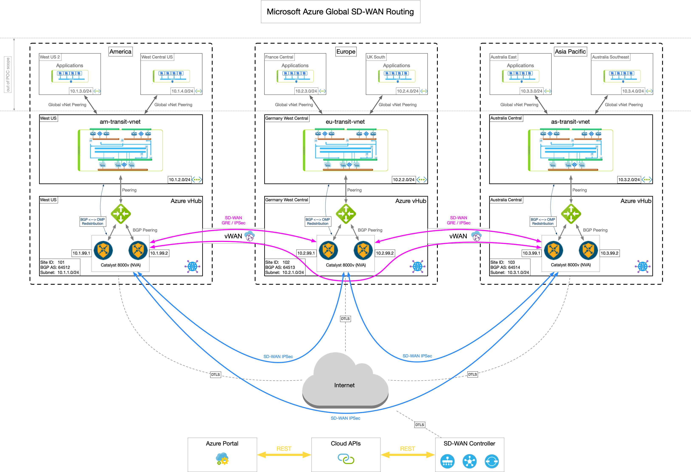

# **Creates Azure backend to provide end-2-end routing**

## Table of Contents <!-- omit in toc -->

- [**Azure World Wide Workload Deployment**]
  - [**1. Overview**](#1-Overview)
  - [**2. Installation**](#2-installation)

## **1. Overview**

* Three global regions has been defined: America / Europe / Australia
* Each global region has a its own transit vNet setup which is the central point of all application vNets within the global region
* vWAN will be implemented with SD-WAN as routing layer for global reachability
* vWan/vHub design is chosen as it provides the capability to leverage Azure Backbone:
  * TLOC vWAN for premium traffic
  * TLOC Internet for bulk traffic
* The three transit vNets (am-transit-vnet/eu-transit-vnet/as-transit-vnet) reflects a typical world wide design.
* Each vNet has an own linux host installed in order to provide end-2-end reachability
* Linux hosts in tranist-vnets also acts as NVA host to route traffic from each spoke (full meshed)
-----



-----

## **2. Installation**

* Step-1: ```terraform plan``` create execution plan as defined in code
* Step-2: ```terraform apply``` deploy Azure environment according to plan file
* Step-3: ```terraform destroy``` delete Azure environemt according to the state file
